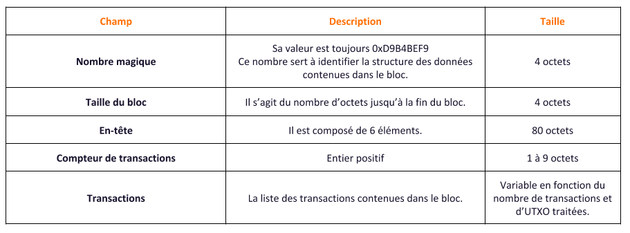
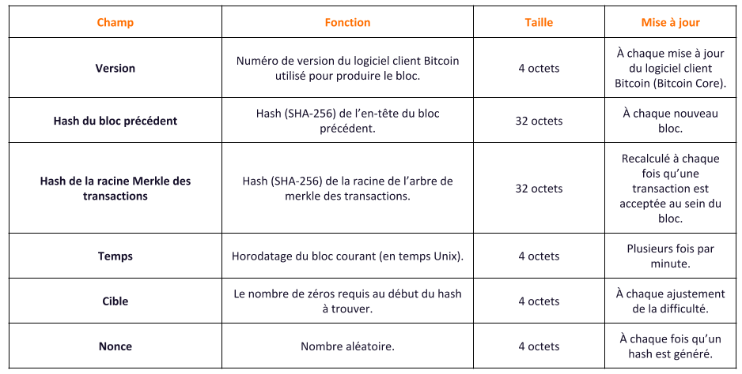
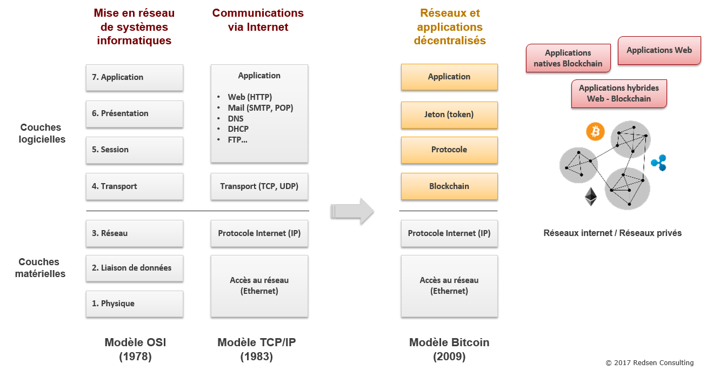

# blockchain-DLT (Distributed Ledger Technology)

## L'arbre de Merkle (Gestion des transactions Impairs)

<u>Introduction:</u> 

Le hachage racine aura toutes les informations de toutes les transactions. 
L'arbre de Merkle hachera à plusieurs reprises, une paire de nœuds jusqu'à ce qu'il ne reste plus qu'un hachage appelé Root Hash.

L'`Arbre Merkle` est un arbre binaire, qui a donc besoin d'avoir un nombre pair de nœuds, si le nombre de transactions est impair, le dernier hachage sera dupliqué une fois pour créer un nombre pair de nœuds.

 

>
Dans l'image ci-dessus, on peut voir le hachage de transaction en double (TE, TEE) lorsqu'il s'agit d'un nombre impair de transactions, c'est ainsi que l'arbre merkle se dupliquera pour un nombre impair de feuilles.

 

## Dans un réseau Bitcoin, comment un nouveau noeud retrouve ses pairs ?
 
Les nœuds du réseau s’assure que la transaction est valide avant de ce diffuser à leurs pairs, dans un premier temps. 
 

Il faut ensuite qu'il se raccorde au bloc aux précédents. 
Pour cela, son en-tête doit revêtir une certaine forme. 
Voir screens ci-dessous.
 

Afin que le bloc soit valide, le hash de l’en-tête de ce dernier doit commencer par un certain nombre de zéros tout en restant inférieur à la valeur donnée à la cible. 
 

## Nommer un personnage qui a ou aurrait pu influencer la création de la Blockchain.

<b>`Wei Dai`</b> fesait partie d'un groupe de Cypherpunks, une communauté qui défendait les droits à la vie privée.
Il émit une proposition concernant l'applications possibles de Hashcash, la première fonction de preuve de travail symétrique pour un l'application du "système de paiement électronique anonyme et distribué", sous l'appelation `B-money`. 
 

## Lien entre les différents Blocks d'une Blockchain
 
Comme je l'ai exprimé dans la question de comment les noeuds trouve leurs places au sein de leurs propre réseau, les screens montrent comment les blocks se retrouve entre eux. 
Il fonctionne comme un système de mailing ou mieux encore le système d'encapsulation du modèle osi voir screen ci-dessous. 
 

 
 

## Structure de données informatique pour (https://en.wikipedia.org/wiki/List_of_data_structures)
 

Il s'agit pour cette structure d'une `Structure de données basé sur le hash` car l'arbre de Merkle à un type de datas sous forme d'arbre (Hash Tree) 
 

## Est ce qu'une modification antérieur passé peut elle être effectué 60 mois après ?
 

`Non`, car cela voudrait dire que l'on peut faslifier les registre de la Blockchain et donc que le système mis en place ne serait tout bonnement pas sécurisé. 

<em>Toutefois, la première cause de faille de sécurité étant humaine étant humaine la sécurité n'est pas assuré à 100%.</em>